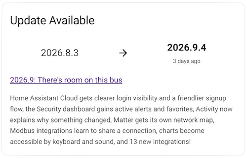

# Version Update Card

A custom Home Assistant dashboard card for displaying version status, update availability, and release information.



When an update is available, the card displays the installed and latest versions along with release information. When Home Assistant is up to date, it displays the installed version and release date in a compact view.

## Features

- Displays installed and latest Home Assistant versions
- Indicates whether an update is available
- Displays the latest release date using Home Assistant's relative-time component
- Shows the release title, description, and release-notes link
- Provides a compact "Up to date" state
- Configurable entities, attributes, and status titles
- Includes a graphical configuration editor
- Uses Home Assistant theme variables and components

## Requirements

This card requires the [Version integration](https://www.home-assistant.io/integrations/version/) configured with the following sources:

- **Local installation** — provides the currently installed Home Assistant version.
- **Home Assistant Website** — provides the latest published version, release information, and update availability.

The Version integration can be configured multiple times to provide both sources. Home Assistant creates a version sensor for each source and, for non-local sources such as Home Assistant Website, a binary sensor indicating whether a newer version than the currently running version is available.

The default card configuration expects:

- `sensor.current_version`
- `sensor.home_assistant_website`
- `binary_sensor.home_assistant_website_update_available`

If your entity IDs differ, select the corresponding entities in the card configuration.

## Installation

### HACS

1. Click to automatically add this repository to HACS:

    [](https://my.home-assistant.io/redirect/hacs_repository/?owner=tbaron&repository=ha-version-update-card&category=plugin)

    - Alternatively, manually add `https://github.com/tbaron/ha-version-update-card` to HACS as a custom **Dashboard** repository.

3. Download **Version Update Card**.
4. Refresh your browser.

### Manual installation

Alternative if not using HACS.

1. Download `version-update-card.js` from the latest release to `/config/www/`.
2. Add `/local/version-update-card.js` as a **JavaScript Module** under **Settings → Dashboards → Resources**.
3. Refresh your browser.

## Usage

With the required Version integration sources configured and the default entities available, no additional card configuration is required:

```yaml
type: custom:version-update-card
```

The complete default configuration is:

```yaml
type: custom:version-update-card

title_update_available: Update Available
title_up_to_date: Up to date

entity_update_available: binary_sensor.home_assistant_website_update_available
entity_version_installed: sensor.current_version
entity_version_latest: sensor.home_assistant_website

attribute_release_date: release_date
attribute_release_title: release_title
attribute_release_description: release_description
attribute_release_notes_url: release_notes
```

All options can also be configured using the dashboard visual editor.

## Configuration

| Option | Default | Description |
| --- | --- | --- |
| `title_update_available` | `Update Available` | Card title when an update is available |
| `title_up_to_date` | `Up to date` | Card title when the installed version is current |
| `entity_update_available` | `binary_sensor.home_assistant_website_update_available` | Binary sensor indicating whether an update is available |
| `entity_version_installed` | `sensor.current_version` | Entity containing the installed Home Assistant version |
| `entity_version_latest` | `sensor.home_assistant_website` | Entity containing the latest available version |
| `attribute_release_date` | `release_date` | Attribute containing the release date |
| `attribute_release_title` | `release_title` | Attribute containing the release title |
| `attribute_release_description` | `release_description` | Attribute containing the release description |
| `attribute_release_notes_url` | `release_notes` | Attribute containing the release-notes URL |

The release attributes are read from `entity_version_latest`.

## Customization

Additional styling can be applied using [card-mod](https://github.com/thomasloven/lovelace-card-mod).

For example, to change the version size and emphasize the latest version:

```yaml
type: custom:version-update-card
card_mod:
  style:
    version-update-card$: |
      .version {
        font-size: var(--ha-font-size-2xl);
      }

      .version-latest {
        color: var(--primary-color);
      }
```

The card exposes descriptive classes that can be targeted with card-mod, including:

- `.version-current`
- `.version-latest`
- `.arrow`
- `.date`
- `.release-info`
- `.release-title`
- `.release-description`

## Example

```yaml
type: custom:version-update-card
title_update_available: Home Assistant Update
title_up_to_date: Home Assistant is current
entity_update_available: binary_sensor.home_assistant_website_update_available
entity_version_installed: sensor.current_version
entity_version_latest: sensor.home_assistant_website
attribute_release_date: release_date
attribute_release_title: release_title
attribute_release_description: release_description
attribute_release_notes_url: release_notes
```

## License

MIT
